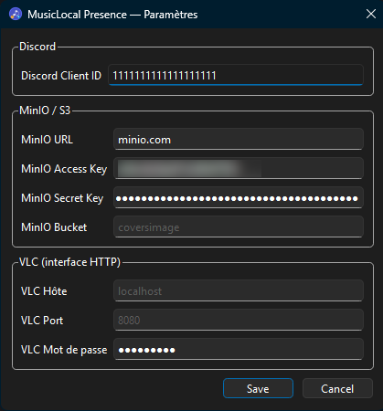

# 🪟 MusicLocal Discord Presence 🐧

> Pour le français, [rendez-vous ici](README_FR.md).

Show what you're listening to on Discord — with album art stored on your own MinIO/S3 instance. Works with **Windows** (SMTC) and **Linux** (MPRIS), supporting Chrome, Spotify, VLC, WACUP, and more.


---

## Features

- Detects the active media session automatically (SMTC on Windows, MPRIS on Linux)
- VLC support via its built-in HTTP API
- Album art uploaded to MinIO/S3 with SHA-256 deduplication cache
- Discord Rich Presence with track title, artist, album art, and progress bar
- System tray icon with status indicator (Qt on Windows/Linux, GTK on GNOME)
- **Settings window** — everything is configured through the UI, no config file to edit
- Auto-update: notified when a new version is available, one click to download and install

---

## Requirements

- A Discord application ([developer portal](https://discord.com/developers/applications))
- A MinIO or S3-compatible instance with a public bucket
- (Optional) VLC with the HTTP interface enabled

---

## Installation

Download the latest installer from the [Releases](https://github.com/Bit-Scripts/MusicLocal-Discord-Presence/releases) page and run it. Launch the app — it will appear in the system tray. Open **Settings** from the tray menu to configure it.

### From source

```bash
git clone https://github.com/Bit-Scripts/MusicLocal-Discord-Presence.git
cd MusicLocal-Discord-Presence

# Windows
pip install -r requirements-windows.txt

# Linux
pip install -r requirements-linux.txt

python main.py
```

---

## Configuration

All settings are entered through the **Settings window**, accessible by right-clicking the tray icon.



| Field | Description | Where to find it |
|---|---|---|
| **Discord Client ID** | Your Discord application's client ID | [discord.com/developers/applications](https://discord.com/developers/applications) → your app → OAuth2 → Client ID |
| **MinIO URL** | Your MinIO server address (without `https://`) | Your MinIO/TrueNAS admin panel, e.g. `minio.example.com` |
| **MinIO Access Key** | MinIO access key | MinIO console → Access Keys |
| **MinIO Secret Key** | MinIO secret key | MinIO console → Access Keys (shown once on creation) |
| **MinIO Bucket** | Bucket name for album art storage | Create a public bucket in your MinIO console, e.g. `coversimage` |
| **VLC Host** | VLC HTTP interface host | Leave `localhost` if VLC runs on the same machine |
| **VLC Port** | VLC HTTP interface port | Default is `8080` |
| **VLC Password** | VLC HTTP interface password | Set in VLC → Tools → Preferences → Interface → Lua HTTP password |

Settings are saved automatically to `%APPDATA%\MusicPresence\` (Windows) or `~/.config/MusicPresence/` (Linux).

---

## Discord application setup

1. Go to [discord.com/developers/applications](https://discord.com/developers/applications)
2. Create a new application
3. Copy the **Client ID** and paste it in the Settings window
4. Go to **Rich Presence → Art Assets** and upload player icons with these names: `chrome`, `spotify`, `vlc`, `wacup`, `default_icon`

---

## VLC setup

1. Open VLC → Tools → Preferences → show **All**
2. Interface → Main interfaces → check **Web**
3. Interface → Main interfaces → Lua → set a **Lua HTTP password**
4. Restart VLC
5. Enter the password in the Settings window under **VLC Password**

---

## Supported players

| Player | Platform | Via |
|---|---|---|
| Chrome / Edge / Firefox | Windows | SMTC |
| Spotify | Windows | SMTC |
| WACUP | Windows | SMTC |
| VLC | Windows & Linux | HTTP API |
| Spotify / Clementine / Strawberry / mpv | Linux | MPRIS |
| MPD / SMPlayer / MellowPlayer / Lollypop | Linux | MPRIS |

---

## Build from source

```bash
pip install pyinstaller
pyinstaller MusicPresence.spec --distpath dist --workpath build
```

The CI/CD pipeline (GitHub Actions) builds and publishes binaries automatically on each version tag.

---

## License

MIT — see [LICENSE](LICENSE) if present.

---

*Inspired by [MPRIS-Discord-Presence](https://github.com/Bit-Scripts/MPRIS-Discord-Presence)*
